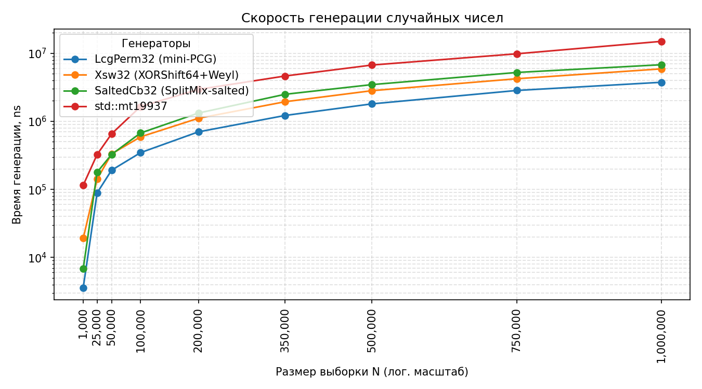

# ГСПЧ и их сравнение

## Программа реализует 3 вида генераторов:
- **Три компактных ГПСЧ** (LcgPerm32, Xsw32, SaltedCb32)
     и стандартный *std::mt19937* с унифицированным интерфейсом `next()`.
 *  - **Пять простейших тестов из пакета NIST‑STS**: частоты (Monobit),
     частоты по блокам, чередований (Runs), максимальной серии единиц
     и сумм накопленных отклонений (Cusum).
 *  - **Χ²‑тест равномерности** (10 корзин) по 32‑битным словам.
 *  - **Измерение производительности** генераторов на возрастающих объёмах
 *    данных с сохранением результатов в CSV‑файл `rng_speed.csv`

 ---

## 📈 Графики производительности

| График                                | Описание |
|---------------------------------------|----------|
|  | Сравнение времени генерации разными ГСПЧ |

---

## 📄 Документация

Документация создана с помощью Doxygen и доступна локально по пути:

📁 `docs/html/index.html`  
📌 [Открыть документацию (локально)](docs/html/index.html)

---

## 🧠 Выводы
Генераторы показывают себя хорошо, они прошли все выбранные NIST тесты, несмотря на достаточно маленький размер выборки
Генераторы показывают ~50% выбросов при критерии Χ², что и должны показывать *честные* ГСПЧ при уровне значимости 0.5